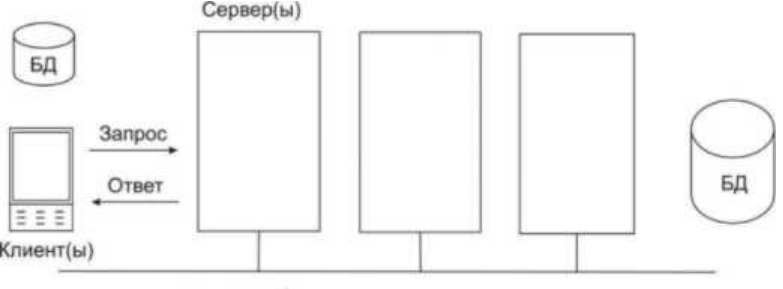

# Архитектура мобильных приложений

#### Архитектура "клиент-сервер"

Архитектура приложения часто создаётся для иллюстрации общих свойств программного обеспечения (например код приложения и платформы) и оборудования (клиент, сервер и сетевые устройства).

Архитектура приложения, как правило, проектируется в терминах архитектуры "клиент-сервер", при которой одно или несколько клиентских устройств запрашивает информацию с сервера. Сервер обычно отвечает необходимой информацией.

Существуют следующие понятия "клиент-серверной" архитектуры:

- Слои 
- Уровни 
- Связи между слоями и уровнями

#### Слои

Функциональность кода по всему приложению обязательно равномерная. Некоторые раздела кода приложения лучше подходят для обработки пользовательского интерфейса, в то время как другие для управления бизнес-логикой или соединения с базой данных или серверных систем.

Расслоение описывает разделение работ внутри кода приложения на одной машине. Зачастую слои это не более чем программные модули, которые размещены в разных папках или каталогах на стороне клиента или сервера.

Со стороны клиента обычно имеется от 0 до 3 слоёв в коде приложения. Со стороны сервера - от 1 до 3 слоёв кода приложения. Частично это важно для  хорошего проектирования программного обеспечения, которое гарантирует повторное использование кода, частично это важно для безопасности, а от части из соображений удобства.

Клиент с нулевым количеством слоёв кода, не имеет специального кода приложения. Этот тип клиента обычно упоминается как тонкий клиент и возможно в архитектуре "клиент-сервер" при которой сервер содержит весь пользовательский код приложения. Клиент с 1 до 3 слоёв кода приложения обычно называется толстым клиентом.

Сервер также может содержать от 1 до 3 слоёв специального кода приложения, тем не менее, по определению не может быть меньше 1 слоя кода на сервере.

Слой, код которого наиболее тесно взаимодействует с пользователем часто упоминается как слой представления (например интерфейс). Второй слой обычно обрабатывает бизнес-логику кода. Третий слой называется "слой доступа к данным", оттуда связь с базой данных.

Вполне возможно наличие более чем 3 слоёв на стороне клиента или сервера, но слишком много слоёв может привести к трудностям при управлении.

#### Уровни

Разбиение функциональности кода приложения на слои помогает повторному использованию, но это не делает архитектуру автоматически масштабируемой. Для того, чтобы это сделать важно распределять код на нескольких машинах.

Уровень описывает разделение работ прикладного кода на нескольких машинах. Многоуровневость, как правило, предполагает размещение уровней на разных машинах в распределённых серверных блоках. Если код приложения уже распределён по слоям, то это делает многоуровневость гораздо более простым процессом.

Код, который наиболее тесно взаимодействует с пользователем, часто расположен на уровне представления. Второй уровень, который содержит логику бизнес-приложений и логику доступа к данным часто упоминается как уровень приложений. Третий ярус обычно содержит базу данных или источник данных и упоминается как уровень базы данных.

Серверы, входящие в состав каждого уровня могут отличаться как по возможностям, так и по номерам. Например, в крупномасштабной, распределённой среде веб-приложение может иметь большое количество веб-серверов, меньшее число серверов приложений на прикладном уровне и 2 кластеризованных серверов баз данных на уровне баз данных. Возможность добавления дополнительных серверов часто называют горизонтальным масштабированием. Добавление более мощных серверов - вертикальным масштабированием. Многоуровневость прикладного кода в таких случаях значительно облегчает возможности масштабирования приложений.

В крупномасштабных, распределённых веб-приложениях уровни часто ограничены брандмауэрами. Например, брандмауэр может быть помещён перед уровнем представления, в то время как второй брандмауэр может быть помещён перед уровнем приложений. Таким образом, уровень представления находится между брандмауэрами в так называемой демилитаризованной зоне (ДЗ), в то время как уровни приложения и базы данных защищены вторым брандмауэром и расположены в так называемой зоне "интрасети", следовательно масштабируемость способствует безопасности и позволяет крупным предприятиям защитить важные внутренние системы от трафика, исходящих из ненадёжных зон, таких как интернет. Без масштабируемости очень трудно защитить.

#### Клиент 
Как правило, мобильные устройства могут работать в качестве тонких/толстых клиентов или могут быть разработаны таким образом, что становятся хостами веб-страниц. 

#### Тонкий клиент 
Тонкие клиенты не имеют пользовательского прикладного кода, и их функциональность полностью обеспечивается сервером (рис. 1.5). Таким образом, они не зависят от операционной системы мобильного устройства или мобильного устройства типа толстого клиента. 
Тонкие клиенты обычно используют веб-браузеры и протокол беспроводного доступа (WAP), чтобы отображать следующие типы страниц прикладного содержания: 
- Web (например. HTML, XML);

- WАР (например, WML). 

Например, веб-страницы КПК может отображать через Microsoft Pocket Internet Explorer, в то время как планшетные и портативные ПК - через Microsoft Internet Explorer или Google Chrome. Аналогичным образом WAP-браузер на сотовом телефоне может показывать WML-страницы. 
#### Толстый клиент 
Как правило, толстые клиенты наиболее полезны в ситуациях, когда связь между клиентом и сервером не может быть гарантированной. Например, толстое клиентское приложение может быть в состоянии принимать ввод пользователя и хранение данных в локальной базе данных, пока восстанавливается связь с сервером, данные могут быть перемещены на сервер. Это позволяет пользователю продолжать работать, даже если он/она находится вне контакта с сервером.
Тем не менее толстые клиенты в значительной степени зависят от операционной системы и типа мобильного устройства, поэтому могут быть сложности при повторном использовании и распространении кода. Вы также можете иметь несколько версий кода для поддержки на нескольких устройствах.
Толстые клиенты могут быть реализованы с помощью одного, двух или трех слоев прикладного кода. Тем не менее, если используется только один слой, крайне трудно выделить отдельные сферы/области функциональности и повторно использовать, и распространять код на несколько типов устройств. Таким образом лучше использовать два или предпочтительно три слоя, чтобы использовать как можно большую часть прикладного кода.
#### Хостинг веб-страниц
На мобильном устройстве можно отображать и обрабатывать веб-страницы, даже если мобильный клиент лишь периодически подключен к сети и серверным системам. Для того чтобы это сделать, на мобильном устройстве необходим эквивалент мини-веб-сервера.
Например, компания Microsoft выпустила HTTP-сервер, который работает на КПК как раз для таких целей. Данные, введенные пользователем на веб-странице, обрабатываются HTTP-сервером и хранятся в локальной базе данных, если не могут быть загружены на сервер, пока с ним не восстановится соединение.
Клиенты, которые используют хостинг веб-страницы, также могут иметь от одного до трех слоев. Главное отличие между веб-страницами толстою клиента и окнами Windows заключается в том, что уровень представления отображает и использует веб-страницы, а не формы Windows.
#### Сервер
Архитектура сервера состоит из одного-трех слоев кода, реализованного на одном-трех уровнях. Зачастую строят трехуровневую архитектуру, но у нее есть плюсы и минусы. Например, крупная трехуровневая архитектура может быть достаточно дорогостоящей для реализации. Если приложение ориентировано на ограниченное число пользователей, трехуровневая архитектура может быть избыточной.
#### Одноуровневая архитектура
Одноуровневая архитектура предполагает размещение всех трех слоев кода на одном сервере.
- Преимущества: очень удобно, быстрая разработка и развертывание.
- Недостатки: небольшая масштабируемость и безопасность.

С одной стороны, очень удобно разрабатывать код на одной машине, с другой - очень сложно масштабировать приложение. Для веб-приложения также трудно защитить сервер с помощью брандмауэров и зон безопасности, что может привести к высокому риску безопасности доступа к базе данных.
#### Двухуровневая архитектура
При реализации двухуровневой архитектуры сервер базы данных отделяется от сервера приложений.
- Плюсы: удобство и возможность специализации сервера баз данных.
- Минусы: меньшая масштабируемость, сложности при обеспечении безопасности и дороговизна.

Отделение сервера баз данных позволяет ему стать более специализированным, но по-прежнему крайне сложно применять масштабирование. При такой архитектуре сложно оградить серверы с брандмауэрами и зоны безопасности, хотя это разделение происходит лучше, чем в одноуровневой архитектуре. Тем не менее безопасность приложения все равно небольшая.
#### Трехуровневая архитектура
Трехуровневая архитектура обеспечивает разделение базы данных, сервера приложений и сервера представлений друг от друга.
  Преимущества: масштабируемость, защита с помощью брандмауэров и зон, возможность
  специализации серверов
  Недостатки: избыточность, более сложно развиваться, труднее управлять, дороговизна.
  Типы соединений
  Мобильные устройства обычно работают в одном из трех режимов: всегда на связи, частичное
  подключение или не подключены.
  Постоянное подключение
  Мобильные устройства, как правило, работают в режиме постоянной связи. Мобильные устройства, по
  существу стали расширением существующих приложений и инфраструктуры, позволяющих пользователям
  всегда быть соединенными с приложениями во время работы.
  Частичное подключение
  Иногда мобильные устройства могут быть отключены в течение длительного периода времени.
  Например, сотрудники мобильных офисов могут периодически подключаться к серверу в офисе для
  получения электронной почты, контактной информации или задач, которые предстоит сделать. Работник
  отключает мобильное устройство и выполняет работу вне офиса, во время которой он может ссылаться на скачанную информацию. Пользователь также может локально обновлять информацию на своем мобильном
  устройстве перед повторной синхронизацией мобильного устройства с сервером в более позднее время.
  Без подключения
  Существуют также мобильные устройства, которые никогда не подключаются к серверам, например
  игровые устройства.
  Синхронизация
  Тип соединения влияет на то, каким образом можно синхронизировать данные между мобильным
  устройством и сервером. Синхронизация реализуется двумя основными способами: непрерывно или методом
  с промежуточным хранением.
  Непрерывное соединение
  Когда между клиентом и сервером непрерывное соединение, синхронизация данных между клиентом
  и сервером также является непрерывной и может быть достигнута синхронным или асинхронным способом.
  Синхронное соединение возникает, когда запрос для хранения данных отправляется на сервер, на
  котором хранятся данные. Затем данные помещаются в хранилище, такое как базы данных на сервере. При
  синхронном соединении все данные сохраняются полностью, перед тем как сервер подтверждает получение
  данных и освобождает пользовательский интерфейс клиента.
  Асинхронное соединение происходит, когда сначала на сервер отправляется запрос для хранения
  данных, а только потом они будут сохранены. Данные помещаются …. . Однако при асинхронной связи
  данные не могут быть полностью сохранены до распознавания сервером клиента. Обычно сервер сначала
  распознает запрос клиента и только затем сохраняет данные. После выполнения запроса на хранение сервер
  сообщит об этом клиенту.
  Метод с промежуточным хранением
  Когда не может быть гарантировано соединение между клиентом и сервером, есть возможность
  безопасно хранить и передавать информацию, используя метод с промежуточным хранением. Предположим,
  что устройство не подключено к серверу. Приложение мобильного клиента может сначала сохранить данные
  в локальной базе данных. Позже, когда установится соединение, мобильное приложение передаст их из
  локальной базы данных базе данных на сервере.
  Важно отметить, что, если вы позволите мобильным пользователям таким образом хранить данные в
  локальной базе данных, необходимо также обеспечить их целостность при синхронизации с сервером базы
  данных, т. к. другие пользователи могут добавить или изменить противоречивые данные на своих мобильных
  устройствах.
  Архитектурные шаблоны
  Если предположить, что существует 3 возможных слоя клиента, три уровня сервера и три типа
  подключения, то, в общей сложности. получается 27 возможных комбинаций. Однако не все из них являются
  полезными. В настоящее время самая распространённая модель — это «частичное подключение», поскольку
  связь не всегда может быть гарантирована.
  Нулевая, трехуровневая архитектура непрерывного подключения
  Если мобильный клиент не имеет слоев прикладного кода, это означает, что он является тонким
  клиентом. Сервер хранит весь код приложения и имеет трехуровневую архитектуру.
  Уровень представления имеет прикладной код, который может отображать страницы мобильного
  устройства. Обычные веб-страницы (например. ASP.NET, НTML) доступны для просмотра с помощью веббраузера.
  Уровень представления также взаимодействует с данными и имеет доступ к объектам на уровнях
  приложения и базы данных. Как правило, данные могут быть прочитаны из базы данных и обратно записаны
  во время обновления.
  Эта архитектура очень простая, потому что предполагается, что мобильный клиент всегда будет
  подключен к серверу. Таким образом, нет необходимости в хранении данных приложения на мобильном
  устройстве. Если мобильное устройство будет отключено, то не будет возможности получения всей
  актуальной информации, пока соединение не будет восстановлено.
  Три слоя, три уровня, архитектура частичного подключения
  Мобильный клиент имеет три слоя кода прикладной программы, т. е. он является толстым клиентом.
  Сервер также содержит код приложения и организован в виде трехуровневой архитектуры.
  Мобильный клиент имеет полностью автономное приложение, которое может читать и записывать
  вводимые пользователем данные в локальную базу данных, когда он не подключен к серверу. Когда связь
  восстанавливается, данные могут быть получены из локальной базы данных и загружены на сервер с
  помощью механизма промежуточного хранения данных.
  Принципы разработки архитектуры мобильного приложения
  Ниже перечислены некоторые из принципов создания хорошей архитектуры мобильного приложения.
  На практике может оказаться невозможным достижение всех этих принципов. Тем не менее большинство
  архитектур мобильных приложений удовлетворяют этим принципам. Этап проектирования архитектуры
  должен разрешать вопросы бизнеса и расширять функциональные потребности пользователей.
  Метод независимости
  В идеальном варианте необходимо разработать мобильные приложения, которые насколько возможно
  независимы от типа устройства и платформы. Это не всегда легко или возможно, но хорошие приложения написаны так, что они могут работать на многих устройствах и платформах.
  На практике, однако, большинство приложений скорее всего не соответствуют этим парадигмам. По всей
  вероятности, будет необходимо выбрать наиболее подходящее устройство и платформу и. соответственно,
  писать приложения. Таким образом, почти наверняка придется выбирать мобильные устройства, такие как
  смартфоны или КПК. Каждое устройство и платформа имеют различные характеристики, что необходимо
  принимать во внимание при разработке приложений.
  Высокая производительность и доступность
  Архитектура должна, как правило, иметь отличную производительность при нормальном и пиковом
  периодах потребности в ресурсах. Например, для сайта брокерской площадки электронного бизнеса в день
  пиковой торговли акциями. Если люди могут использовать приложение в любой момент времени, архитектура
  должна обладать также высокой доступностью.
  Масштабируемость
  Архитектура должна быть масштабируемой, чтобы быстро адаптироваться при возможном значительном
  увеличении числа пользователей, приложений и функциональных возможностей. Архитектура должна быть
  разработана так, чтобы легко позволить горизонтальное (дополнительные сервера) и вертикальное
  (добавление более быстрых серверов) масштабирование без ущерба для любых существующих приложений.
  Системные требования пользователя
  Архитектура должна позволять обрабатывать как можно большие типы и количество пользователей.
  Например, веб-приложения с большим объемом графики для отображения на КПК могут быть красивыми, но,
  если пользователи имеют только низкоскоростные линии соединения, производительность не будет
  удовлетворительной. Следует иметь в виду полный спектр пользователей для высоко- и низко
  производительных систем. 